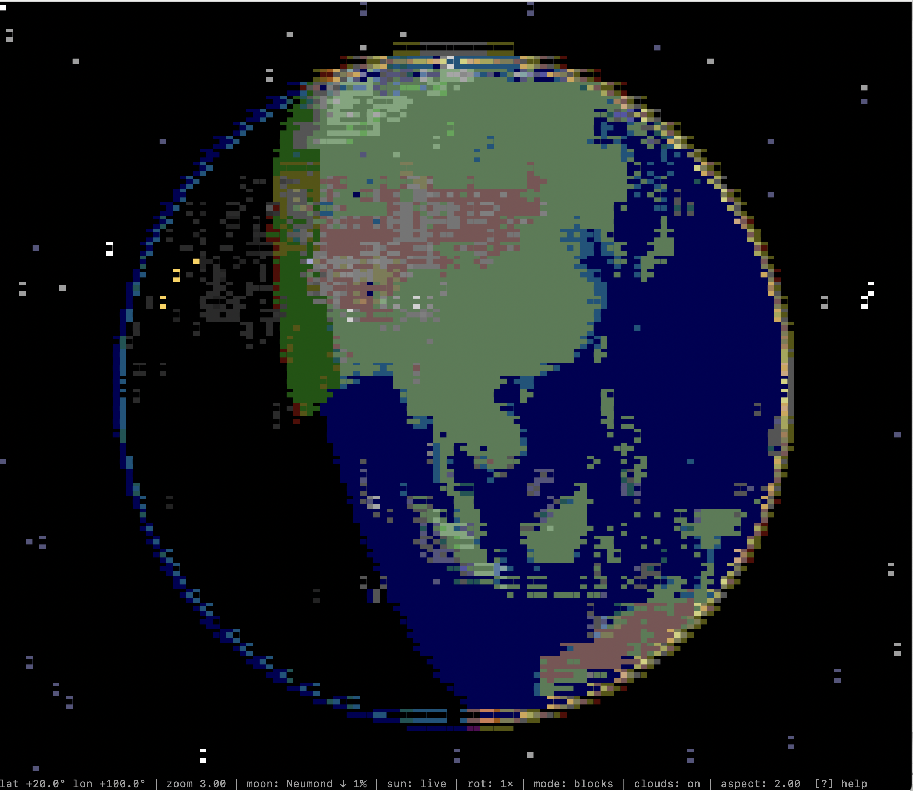

# globe

A rotating globe for your terminal — with live sun position, real-time day/night terminator, city lights on the night side, cloud overlay, stars, sun and moon, plus optional reference lines for equator and Greenwich meridian.



```
cargo run --release
```

`q` or `Esc` to quit.

## Default view

- Camera at your **home position** (user location) — estimated from the system timezone on first launch; overridable with `-h LAT,LON`.
- **Auto-rotation** at real-world speed (15°/h, one revolution per 24 h)
- Live sun position for the current date and time; the day/night terminator visibly drifts with the rotation
- Half-block rendering (`▀`) with 256 ANSI colors — works in practically every modern terminal
- Current moon phase in the status line (e.g. `moon: Halbmond ↑ 51%` — waxing arrow included)

## Keys

| Key                | Normal mode                                      | Freeze mode                                       |
| ------------------ | ------------------------------------------------ | ------------------------------------------------- |
| `←` `→` `↑` `↓`    | Rotate the earth (lon / lat)                     | Move the sun (Δ relative to live position)        |
| `Shift` + arrows   | Fine rotation (10× smaller step)                 | Fine sun rotation                                 |
| `+` / `-`          | Zoom in / out                                    | Zoom in / out                                     |
| `0`                | Reset zoom                                       | Reset zoom                                        |
| `h`                | Jump to home position                            | Jump to home position                             |
| `s`                | Jump to subsolar position (over equator)         | Jump to subsolar position                         |
| `f`                | **Freeze on** — earth + moon pause               | **Freeze off** — discard delta, all live again    |
| `Space`            | Toggle auto-rotation                             | —                                                 |
| `,` / `.`          | Rotation speed −/+                               | —                                                 |
| `m`                | Cycle render mode: blocks → ascii → plain        | Cycle mode                                        |
| `c`                | Toggle cloud layer                               | Toggle cloud layer                                |
| `e`                | Toggle **equator** line (yellow)                 | Toggle equator line                               |
| `g`                | Toggle **Greenwich meridian** (blue)             | Toggle Greenwich meridian                         |
| `(` / `)`          | Calibrate cell-aspect ±0.05                      | Calibrate cell-aspect                             |
| `r`                | Restore defaults (position kept)                 | Defaults + delta zeroed                           |
| `?`                | Help overlay                                     | Help overlay                                      |
| `q` / `Esc`        | Quit                                             | Quit                                              |

## CLI

```
globe [-h LAT,LON] [--fps N] [--mode blocks|ascii|plain] [--no-color]
      [--cell-aspect F] [--snapshot]
```

- `-h 48.21,16.37` / `--home 48.21,16.37` — set position as lat/lon in degrees (overrides timezone estimate)
- `--fps 30` — frame-rate cap (1–120)
- `--mode plain` or `--no-color` — fallback without ANSI colors
- `--cell-aspect 2.10` — cell height/width ratio, raise it when the sphere looks vertically stretched (default 2.0; SF Mono ≈ 2.05, Menlo ≈ 2.10)
- `--snapshot` — render one frame to stdout and exit (handy for tests / CI). Uses the current terminal size.

## Render modes

1. **blocks** (default) — `▀` half-blocks with two colors per cell → highest effective resolution
2. **ascii** — ASCII brightness ramp `" .'.:;,-~!=+*o#%&@"` with per-class color, gamma-stretched + per-class albedo (continent contours visible)
3. **plain** — ASCII without color (for pipes, log files, restrictive terminals)

## Visual details

- **Day/night transition** via smoothstep + Lambert shading; class colors (deep sea, sea, flatland, upland, mountain, ice) interpolate between a day and a night palette.
- **City lights** on the night side. At default zoom only mega-cities; zooming in surfaces medium and small lights (LOD).
- **Clouds** as a second sphere at radius 1.005, alpha-blended, co-rotating at ~1.2× earth speed. Toggle with `c`.
- **Atmospheric halo** at the sphere's edge. Day side warm yellow-white, sunrise/sunset orange, dusk rose-violet, night blue — derived from the lighting at the ray's tangent point to the sphere.
- **Stars** in the background (three brightness tiers).
- **Sun** as a 5-cell star marker (`*●*` with rays above and below).
- **Moon** as a 3-cell marker with a phase symbol (`◐`, `●`, …). Distance compressed to 6 earth-radii (real ~60) so it stays visible at sensible zoom levels.
- **Equator line** (soft yellow) and **Greenwich meridian** (soft blue) are toggleable (`e`/`g`) — both stay locked to the correct geographic position under earth rotation.

## Architecture

```
src/
├── main.rs          Event loop + terminal setup
├── app.rs           AppState + key handlers + frame renderer
├── camera.rs        Camera state (lat/lon/distance + clamping)
├── config.rs        clap CLI parsing
├── constants.rs     Central parameters (FOV, zoom, rotation, thresholds)
├── geo.rs           Home position from timezone or CLI arg
├── moon.rs          Moon orbit (simplified Meeus formula) + phase
├── render.rs        Raycasting, lighting, ANSI colors, glow, stars, markers
├── sun.rs           Subsolar point from astronomy
├── tui.rs           Frame buffer + diff flush
├── vec3.rs          3D vector helpers + lat/lon conversion + rotate_y
└── world.rs         Embedded NASA maps (classes, lights, clouds)
```

## Tests

```
cargo test --lib
```

99 unit and property tests across 11 modules — e.g. full/new moon dates 2026 land on the day, the Sahara classifies as land, the Pacific as deep sea, Tokyo registers city lights.

## Astronomical accuracy

- **Subsolar point**: ≈ 0.01° (simplified NOAA formula)
- **Moon orbit**: ≈ 1° in lat/lon (simplified Meeus formula). Moon distance is compressed to 6 earth-radii for display; phase is computed from the real sun–moon–earth geometry.
- **Earth rotation**: accumulated from wall-clock time; the sun is rotated into the world frame internally so the day/night terminator drifts at the real 15°/h (and not double that).

## Asset pipeline (real NASA maps)

Three binary files in `assets/` are baked straight into the release binary via `include_bytes!`:

| File                    | Resolution  | Source                                                            | Compressed |
| ----------------------- | ----------- | ----------------------------------------------------------------- | ---------- |
| `earth_classes.bin.z`   | 2048×1024   | Blue Marble day map + specular mask (RGB + land/water mask)       | ~92 KB     |
| `earth_lights.bin.z`    | 2048×1024   | Black Marble city lights (threshold + 8-bit grayscale)            | ~52 KB     |
| `earth_clouds.bin.z`    | 1024×512    | MODIS cloud cover (alpha channel, 8-bit)                          | ~146 KB    |

License: all four source textures are **NASA public domain**, mirrored from the Three.js texture repository. Converted by `tools/build_assets.py` (Python + Pillow):

```
python3 tools/build_assets.py
```

The script downloads missing source images over HTTPS, classifies the day map using the specular land/water mask + an RGB heuristic (6 classes), filters the lights, and writes the custom container format (magic `GLBE` + version + dimensions + zlib payload). To use higher-resolution maps (5400×2700, 8192×4096), swap the URLs in the script — the rest of the code is unchanged.

## Known limitations

- Map resolution 2048×1024 (~20 km/pixel) — larger islands (Sicily, Sri Lanka, Madagascar) clearly visible; very small ones (Malta, Mallorca) only as 1–2 pixels
- The cloud layer co-rotates at ~1.2× earth speed (synthetic — the MODIS map is a static composite, not live weather)
- Classification heuristic (RGB → class) is robust, but JPG compression artefacts occasionally produce misclassifications at pixel edges
- Moon distance is artistically compressed to 6 earth-radii; under real geometry the moon would only enter the FOV at extreme zoom-out levels

## License and credits

The Rust code is released under the **MIT License** — see [`LICENSE`](LICENSE).

The embedded map assets come from NASA sources (Blue Marble, Black Marble, MODIS cloud cover) and are **public domain**. Source URLs and attribution are in [`NOTICE`](NOTICE).

## CI

`cargo build --release`, `cargo test --lib`, `cargo clippy -- -D warnings`, and `cargo fmt --check` run automatically on every push and PR, on Linux and macOS — see [`.github/workflows/ci.yml`](.github/workflows/ci.yml).
